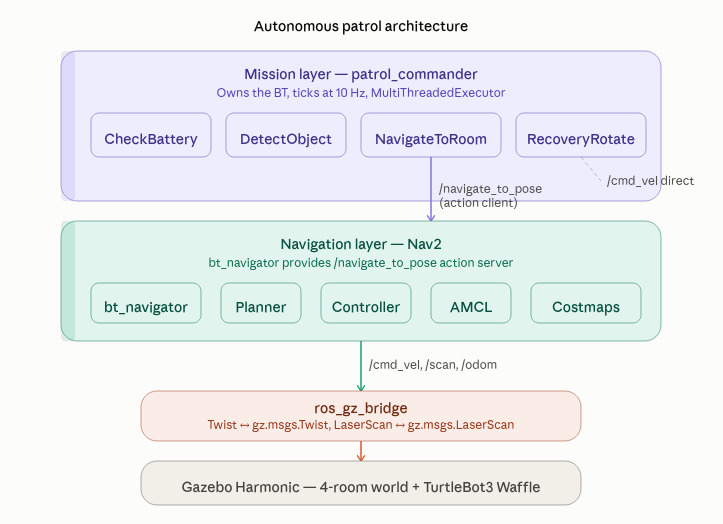

# TurtleBot3 Autonomous Patrol

A behavior-tree-driven autonomous patrol robot in Gazebo Harmonic with ROS2 Jazzy. The robot navigates a 4-room environment, detects objects, manages battery, and executes recovery behaviors — all orchestrated by a custom mission-level behavior tree running in its own process.


## Architecture

The core design decision: **separating mission logic from navigation.**

Nav2's `bt_navigator` runs a per-goal point-navigation tree. A patrol mission — looping through rooms, checking battery, detecting objects, recovering from failures — is not a "navigate to one pose" behavior. It's a mission-level loop that *calls* navigation as a sub-behavior.

So this project runs two layers:

- **Mission layer** (`patrol_commander`): owns a `BT::BehaviorTreeFactory`, registers 7 custom BT nodes, loads `patrol_bt.xml`, and ticks the tree at 10 Hz in its own process. Uses a `MultiThreadedExecutor` so action clients and subscribers stay responsive while the tree ticks.
- **Navigation layer** (Nav2): `bt_navigator` provides `/navigate_to_pose` using Nav2's built-in point-nav tree. The mission tree calls this action as a client.




```
patrol_commander (mission layer)
    └── ticks patrol_bt.xml
          ├── CheckBattery → reads /battery_state
          ├── DetectObject → reads /detections, writes pose to blackboard
          ├── NavigateToRoom → action client → /navigate_to_pose
          ├── ApproachObject → action client → /navigate_to_pose (0.5m offset)
          ├── RecoveryRotate → publishes /cmd_vel directly
          ├── WaitAndRetry → 2s pause, returns FAILURE to trigger retry
          └── ChargeBattery → stub (logs and returns SUCCESS)

bt_navigator (navigation layer)
    └── Nav2 default point-nav tree
          └── planner + controller + costmaps + AMCL
```

## Behavior Tree

```xml
<!-- Per-room pattern (repeated for all 4 rooms) -->
<Fallback>
  <!-- Navigate, unless an object interrupts -->
  <ReactiveSequence>
    <Inverter>
      <DetectObject target="box" object_pose="{object_pose}"/>
    </Inverter>
    <NavigateToRoom x="5.0" y="0.5"/>
  </ReactiveSequence>
  <!-- Object detected mid-drive → approach it -->
  <ApproachObject target_pose="{object_pose}"/>
  <!-- Nav failed, no object → spin to re-localize and retry -->
  <Sequence>
    <RecoveryRotate/>
    <WaitAndRetry/>
  </Sequence>
</Fallback>
```

**Reactive detection interrupt:** `DetectObject` is wrapped in an `Inverter` inside a `ReactiveSequence`. While the robot drives, `DetectObject` returns FAILURE (no object) → Inverter flips to SUCCESS → navigation continues. When an object appears, `DetectObject` returns SUCCESS → Inverter flips to FAILURE → `ReactiveSequence` fails → **`onHalted()` fires on `NavigateToRoom`, canceling the Nav2 goal mid-flight** → Fallback moves to `ApproachObject`.

**Battery monitoring:** The outer `ReactiveSequence` re-checks `CheckBattery` every tick. If battery drops below 20%, the patrol halts and `ChargeBattery` fires.

**Recovery:** If `NavigateToRoom` fails (blocked path, localization drift), `RecoveryRotate` spins 360° to gather lidar data for re-localization. `WaitAndRetry` returns FAILURE after 2 seconds, causing the parent Fallback to retry navigation from the top.

## Custom BT Nodes

| Node | Base Class | Purpose |
|------|-----------|---------|
| `CheckBattery` | ConditionNode | Subscribes to `/battery_state`, SUCCESS if ≥ 20% |
| `DetectObject` | ConditionNode | Subscribes to `/detections`, writes pose to blackboard |
| `NavigateToRoom` | StatefulActionNode | Two-phase async action client → Nav2 `/navigate_to_pose` |
| `ApproachObject` | StatefulActionNode | Same pattern, reads PoseStamped port, applies 0.5m offset |
| `RecoveryRotate` | StatefulActionNode | Publishes `cmd_vel` for 6.28s (360° at 1 rad/s) |
| `WaitAndRetry` | StatefulActionNode | Waits 2s, returns FAILURE to trigger Fallback retry |
| `ChargeBattery` | SyncActionNode | Stub — logs and returns SUCCESS |

All nodes publish status to `/bt_log` for real-time narration during demos.

## Key Patterns

**Subscriber stores, `tick()` decides:** BT nodes are not ROS2 nodes. They pull the shared `rclcpp::Node` handle from the blackboard. Subscriber callbacks only store values; `tick()` reads them and returns `NodeStatus`. These are decoupled execution paths.

**Two-phase async action client:** `onStart()` sends the goal via `async_send_goal()`. `onRunning()` polls the goal future (phase 1: acceptance), then the result future (phase 2: completion). `onHalted()` cancels the in-flight goal with `async_cancel_goal()`. This pattern repeats in `NavigateToRoom` and `ApproachObject`.

**Single registration point:** `BT_REGISTER_NODES` expands to a function with a fixed symbol name. Multiple copies in one `.so` cause linker conflicts. All 7 nodes are registered in a single `register_nodes.cpp`.

## Quickstart

```bash
# Prerequisites: ROS2 Jazzy, Gazebo Harmonic, Nav2, slam_toolbox, TurtleBot3 packages

# Build
cd ~/gz_ws
colcon build --packages-select turtlebot3_autonomous_patrol
source install/setup.bash

# Terminal 1: Gazebo simulation
ros2 launch turtlebot3_autonomous_patrol four_rooms_launch.py

# Terminal 2: Nav2 + patrol commander
ros2 launch turtlebot3_autonomous_patrol nav_launch.py

# Terminal 3: Battery state (mock sensor)
ros2 topic pub /battery_state std_msgs/msg/Float32 "{data: 80.0}" --rate 1

# Terminal 4: Live BT narration (the demo money shot)
ros2 topic echo /bt_log
```

The patrol starts automatically — no nav goal needed. The robot visits all 4 rooms in sequence.

**Trigger object detection:**
```bash
ros2 topic pub /detections std_msgs/msg/String "{data: 'box'}" --once
```

**Trigger low battery:**
```bash
ros2 topic pub /battery_state std_msgs/msg/Float32 "{data: 15.0}" --rate 1
```

## Coordinate System

Gazebo world coordinates ≠ map frame coordinates. SLAM set the origin where the robot spawned.

```
Offset: map_x ≈ gazebo_x − 1, map_y ≈ gazebo_y − 5.5

Room centers (map frame):
  Room 1 (top-left):     (1.0, 0.5)
  Room 2 (top-right):    (5.0, 0.5)
  Room 3 (bottom-right): (5.0, -3.5)
  Room 4 (bottom-left):  (1.0, -3.5)
```

## Project Structure

```
turtlebot3-autonomous-patrol/
├── config/
│   ├── bridge.yaml           # Gazebo↔ROS2 topic bridge
│   ├── slam_params.yaml      # slam_toolbox async config
│   ├── nav2_params.yaml      # Full Nav2 stack config
│   └── patrol_bt.xml         # Patrol behavior tree XML
├── include/turtlebot3_autonomous_patrol/
│   ├── bt_logger.hpp         # Static /bt_log publisher
│   ├── check_battery.hpp     # Battery condition node
│   ├── detect_object.hpp     # Object detection condition node
│   ├── navigate_to_room.hpp  # Nav2 action client (room coords)
│   ├── approach_object.hpp   # Nav2 action client (object pose)
│   ├── recovery_rotate.hpp   # 360° spin recovery
│   ├── wait_and_retry.hpp    # Timed wait, returns FAILURE
│   └── charge_battery.hpp    # Charging stub
├── src/
│   ├── patrol_commander.cpp  # Mission-level BT executor
│   └── register_nodes.cpp    # BT node registration
├── launch/
│   ├── four_rooms_launch.py  # Gazebo sim + robot spawn
│   ├── nav_launch.py         # Nav2 + patrol commander
│   └── slam_launch.py        # slam_toolbox for mapping
├── models/                   # TurtleBot3 Waffle SDF, table model
├── worlds/
│   └── four_rooms.sdf        # 8x8m 4-room environment
├── CMakeLists.txt
└── package.xml
```

## What I Learned

The biggest lesson was discovering that `bt_navigator` runs a per-goal navigation tree, not a persistent mission loop. My custom patrol tree was silently never executing — Nav2's default tree handled navigation fine, so the robot moved but none of my BT nodes constructed. The `/bt_log` topic never appeared, which is how I caught it.

The fix was an architecture pivot: run the patrol tree in my own `patrol_commander` process, calling Nav2's `/navigate_to_pose` as an action client. This separation — mission layer calling navigation layer — is how real robot mission executors are built, and it's a much stronger design than trying to shoehorn a patrol loop into `bt_navigator`.

Other hard-won lessons:
- `BT_REGISTER_NODES` can only appear once per shared library (fixed symbol name)
- `lifecycle_manager` deadlocks if any node in its list isn't launched
- `navigate_through_poses` causes duplicate ID crashes in Jazzy
- `inflation_radius` must be ≥ inscribed radius (0.176) or the robot clips walls
- `slam_toolbox` in Jazzy is a lifecycle node requiring explicit configure→activate

## Built With

- ROS2 Jazzy
- Gazebo Harmonic (Fortress API)
- Nav2
- BT.CPP v4
- slam_toolbox
- C++17

## Notes

- `ChargeBattery` is a stub — in production this would navigate to a charging dock and monitor battery until full.
- `DetectObject` writes a fixed inspection pose for the demo. In production, the pose would come from the perception pipeline.
- The 4-room world coordinates are specific to the saved map. Re-mapping requires updating room coordinates in `patrol_bt.xml`.
